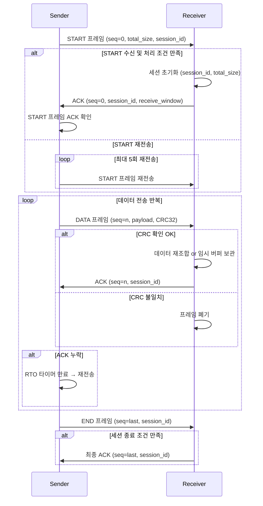

```mermaid
sequenceDiagram
    participant Sender
    participant Receiver

    %% 1. 세션 시작 핸드셰이크
    Sender->>Receiver: START 프레임 (seq=0, total_size, session_id)
    alt START 수신 및 처리 조건 만족
        Receiver->>Receiver: 세션 초기화 (session_id, total_size)
        Receiver->>Sender: ACK (seq=0, session_id, receive_window)
        Sender->>Sender: START 프레임 ACK 확인
    else START 재전송
        loop 최대 5회 재전송
            Sender->>Receiver: START 프레임 재전송
        end
    end

    %% 2. 데이터 전송
    loop 데이터 전송 반복
        Sender->>Receiver: DATA 프레임 (seq=n, payload, CRC32)
        alt CRC 확인 OK
            Receiver->>Receiver: 데이터 재조합 or 임시 버퍼 보관
            Receiver->>Sender: ACK (seq=n, session_id)
        else CRC 불일치
            Receiver->>Receiver: 프레임 폐기
        end
        alt ACK 누락
            Sender->>Sender: RTO 타이머 만료 → 재전송
        end
    end

    %% 3. 세션 종료 핸드셰이크
    Sender->>Receiver: END 프레임 (seq=last, session_id)
    alt 세션 종료 조건 만족
        Receiver->>Sender: 최종 ACK (seq=last, session_id)
    end
```